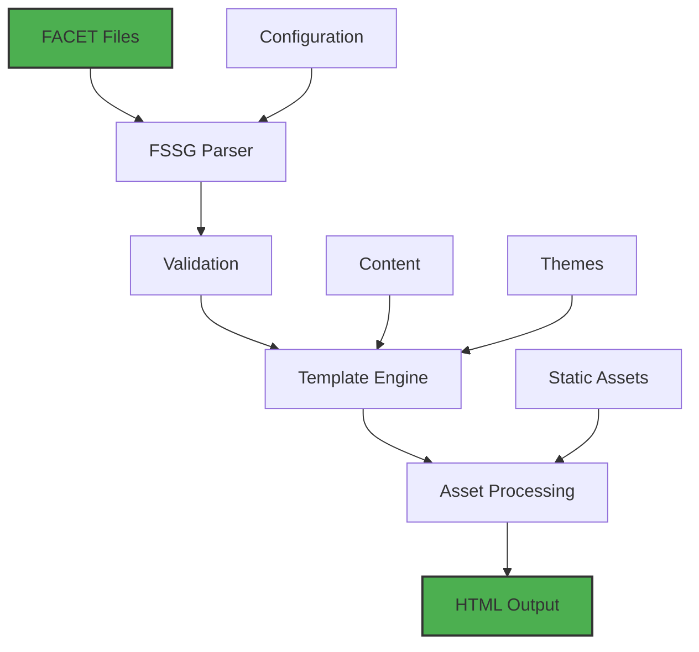

# FSSG – FACET Static Site Generator

**A deterministic static site generator for the AI era.**

<div align="center">
  
  <br>
  <h3>🚀 FACET Static Site Generator</h3>
  <p><em>Turns FACET canonical JSON into production-grade static websites with byte-for-byte reproducible builds.</em></p>
</div>

---

<div align="center">

<p>
  
  
  
  
</p>

<p>
  
  
  
  
</p>

</div>

## What is FSSG?

This repository houses **FSSG (FACET Static Site Generator)**—the deterministic build engine that turns FACET canonical JSON into production-grade static websites. FSSG concentrates on the generator itself: configuration, build pipeline, renderer, and CLI surface. No guesswork, no hidden state, just reproducible artefacts.

> ℹ️ Local development may include a FACET reference checkout for validation, but the `FACET/` tree is git-ignored. Released packages ship only the generator.

## 🚀 Quick Start

### Installation

```bash
# Install from PyPI
pip install fssg

# Or install in development mode
git clone https://github.com/rokoss21/FACET-FSSG.git
cd FACET-FSSG
pip install -e .
```

### Basic Usage

```bash
# Show help
fssg --help

# Build a site from FACET JSON
fssg build -c config.json

# Watch for changes and rebuild
fssg watch -c config.json

# Validate configuration
fssg validate -c config.json
```

## Why FSSG
- **Determinism by default** – Identical sources always produce byte-for-byte identical output. Builds remain diff-friendly, CI stays trustworthy.
- **Safety throughout** – Validation enforces the FACET specification end to end. Interpolation in attributes (F304), missing metadata, or unsafe imports are surfaced before anything ships.
- **Intentional interactivity** – HTML renders complete without JavaScript. Optional “islands” can be added deliberately, scoped, and audited.
- **Operational clarity** – Every stage of the pipeline is explicit—from parse to emit—so teams can reason about what changed and why.
- **Ready to install** – Available on PyPI as [`fssg`](https://pypi.org/project/fssg/1.1.0/) with CLI entrypoint `fssg` and Python 3.9+ support.

## ✨ Features

<div align="center">

| Feature | Description |
|---------|-------------|
| **🎯 Deterministic** | Byte-for-byte identical builds from same inputs |
| **🛡️ Safe by Default** | Validates FACET spec end-to-end, catches errors early |
| **⚡ Fast & Efficient** | Optimized rendering pipeline with Jinja2 templating |
| **🔧 CLI Ready** | Full command-line interface with watch mode |
| **📦 PyPI Package** | Easy installation via pip, no build tools required |
| **🔍 Audit Trail** | Complete build logs with error codes and diagnostics |
| **🌐 Multi-format** | HTML, Markdown, YAML processing built-in |
| **🚀 Production Ready** | Critical CSS, CSP, accessibility by default |

</div>

## 🏗️ Architecture

<div align="center">



</div>

## 📁 Repository Layout

| Path | Description |
| --- | --- |
| `fssg/` | Python package: parser integration, routing graph, renderer, CLI entry point. |
| `content/`, `layouts/`, `theme/`, `public/` | Minimal demo site used for local verification and end-to-end smoke tests. |
| `fssg.config.json` | Reference configuration showcasing deterministic defaults. |
| `AGENTS.md`, `FSSG.md` | Architectural dossiers detailing roles, pipeline stages, and specification notes. |
| `archive/` | Legacy demos, experiments, and benchmarks (ignored by Git but handy locally). |

## 🌐 Part of the FACET Ecosystem
FSSG is one layer of a deterministic AI stack maintained by [rokoss21](https://github.com/rokoss21). Each project plays a specific role:

- **[FACET Language](https://github.com/rokoss21/FACET)** – The contract. A deterministic DSL that compiles human-readable instructions into canonical JSON.
- **[FSSG](https://github.com/rokoss21/FACET-FSSG)** – The publisher. Consumes FACET JSON to generate trustable artefacts, documentation, and static sites (this repository).
- **[FACET Agents](https://github.com/rokoss21/FACET-AGENTS)** – The application layer. Declarative agent blueprints that rely on FACET for structure and on FSSG to ship specs, docs, and playbooks.
- **[FACET MCP Server](https://github.com/rokoss21/FACET_mcp)** – The runtime. A high-performance MCP implementation that executes FACET plans (`execute`), deterministic transformations (`apply_lenses`), and schema validation (`validate_schema`).
- **[RMCP Protocol](https://github.com/rokoss21/rmcp-protocol)** – The operating system. An orchestration layer (Facet Engine) that coordinates MCP servers, agents, and policies at scale.

<div align="center">

| Project | Role | Status |
|---------|------|--------|
| **[FACET Language](https://github.com/rokoss21/FACET)** | Contract Layer | ✅ Active |
| **[FSSG](https://github.com/rokoss21/FACET-FSSG)** | Publishing Layer | ✅ Active |
| **[FACET Agents](https://github.com/rokoss21/FACET-AGENTS)** | Application Layer | ✅ Active |
| **[FACET MCP Server](https://github.com/rokoss21/FACET_mcp)** | Runtime Layer | ✅ Active |
| **[RMCP Protocol](https://github.com/rokoss21/rmcp-protocol)** | Orchestration Layer | ✅ Active |

</div>

Together they form a closed loop: **FACET** defines structure → **FSSG** publishes artefacts → **MCP** executes plans → **Agents** apply them → **RMCP** orchestrates everything. Keeping FSSG lean ensures every other layer can depend on identical, reviewable output.

## Getting Started

### Prerequisites
- Python 3.9 or newer (per `fssg/pyproject.toml`).
- Pip / virtualenv recommended.

### Install FSSG (editable mode)
```bash
python3 -m venv .venv
source .venv/bin/activate
pip install -e fssg
```

### Build the demo site
```bash
# from the repository root (virtualenv active)
fssg build -c fssg.config.json
# Static output is written to ./dist/ (ignored by Git)
```

### Run the test suite
```bash
PYTHONPATH=FACET/facet-lang pytest FACET/facet-lang/tests
```

> **Note** – Parser and lens tests rely on the local FACET checkout. Production deployments only require the packaged FSSG artefacts.

## Deterministic Workflow Guarantees
1. **Strict parsing** – FACET canonical JSON is generated by a specification-aligned canoniser (`facet_lang`).
2. **Safe imports** – Relative `@import` statements are resolved against explicit allow-lists with cycle/depth detection.
3. **Type validation** – `@var_types` guard the inputs to lenses and template expansion; violations raise the documented FACET error codes.
4. **Idempotent rendering** – FSSG renders to HTML with no runtime mutation, zero JavaScript by default, and optional post-processing hooks.
5. **Hermetic outputs** – Build artefacts land in `dist/` (gitignored). Rebuilding without source changes reproduces identical files byte-for-byte.

## Development Tips
- Keep experiments inside `archive/`; it stays out of version control while remaining close at hand.
- FACET authoring is strict by design: two-space indentation, no tabs (F002), no attribute interpolation (F304).
- When you tweak canonisation or lenses, update tests alongside—local correctness matters even if the FACET tree is ignored upstream.
- For multi-repo setups, pass explicit `--import-root` / `current_file` to `canonize` so relative imports remain sandboxed.

## Philosophy at a Glance
- **Tooling as contract** – The FACET specification is the contract. FSSG implements it faithfully so humans and automation share the same deterministic language.
- **Audit-friendly diagnostics** – Error codes such as `F304`, `H101`, `P101` make build logs readable and actionable.
- **Composable outputs** – Multiple render targets (`html`, `islands`, `react`) are fed by one canonical JSON tree, eliminating divergence.
- **Future-proof defaults** – Critical CSS, precompression, strict CSP, and accessibility affordances ship as defaults rather than optional extras.

## Learn More Across the Stack
- Read the [FACET specification](https://github.com/rokoss21/FACET) to understand the language contract that feeds FSSG.
- Explore the [FACET Agents](https://github.com/rokoss21/FACET-AGENTS) repository for real-world blueprints authored in FACET and published via FSSG.
- Integrate deterministic tooling into AI assistants with the [FACET MCP Server](https://github.com/rokoss21/FACET_mcp).
- See how large fleets of tools and agents are coordinated using the [RMCP Protocol](https://github.com/rokoss21/rmcp-protocol).

Each layer reinforces the others: FACET defines intent, FSSG publishes truth, MCP executes plans, and RMCP orchestrates them at scale.

## Releasing
1. Run the full FACET test suite.
2. Build the reference site (`fssg build -c fssg.config.json`) and spot-check output.
3. Tag versions consistently for both subprojects (`FACET/__init__`, `fssg/__init__`, `pyproject.toml`).
4. Publish packages (PyPI or internal registry) from the clean tree with no pending artefacts. See [PUBLISHING.md](PUBLISHING.md) for step-by-step instructions using PyPI API tokens.

## 🤝 Contributing

We welcome contributions to make FSSG even better! Here's how you can help:

### Ways to Contribute
- **🐛 Report Bugs**: Open an issue with detailed reproduction steps
- **✨ Request Features**: Share your ideas for new functionality
- **📝 Improve Documentation**: Help make docs clearer and more comprehensive
- **🧪 Write Tests**: Add test cases for edge cases and new features
- **💻 Submit Pull Requests**: Code contributions are always welcome

### Guidelines
- Follow the [FACET specification](https://github.com/rokoss21/FACET) and existing code patterns
- Provide deterministic tests alongside new features or bug fixes
- Document new error codes or functionality in `FSSG.md` and relevant specs
- Keep changes focused and well-documented

---

## 📞 Support & Community

<div align="center">

| Channel | Link | Purpose |
|---------|------|---------|
| **📚 Documentation** | [README](./README.md) | Getting started guide |
| **🐛 Issues** | [GitHub Issues](https://github.com/rokoss21/FACET-FSSG/issues) | Bug reports and feature requests |
| **💬 Discussions** | [GitHub Discussions](https://github.com/rokoss21/FACET-FSSG/discussions) | Community discussions |
| **📧 Email** | `ecsiar@gmail.com` | Direct contact |

</div>

---

## 🙏 Acknowledgments

- Built with ❤️ using Python, Jinja2, and the FACET ecosystem
- Inspired by the need for deterministic AI tooling
- Powered by the amazing open-source community

---

<div align="center">

**⭐ If you find FSSG useful, please consider giving it a star on [GitHub](https://github.com/rokoss21/FACET-FSSG)!**

<br>

[](https://opensource.org/licenses/MIT)
[](https://www.python.org/)
[](https://github.com/rokoss21/FACET)

</div>

Enjoy building deterministic content workflows! 🚀
